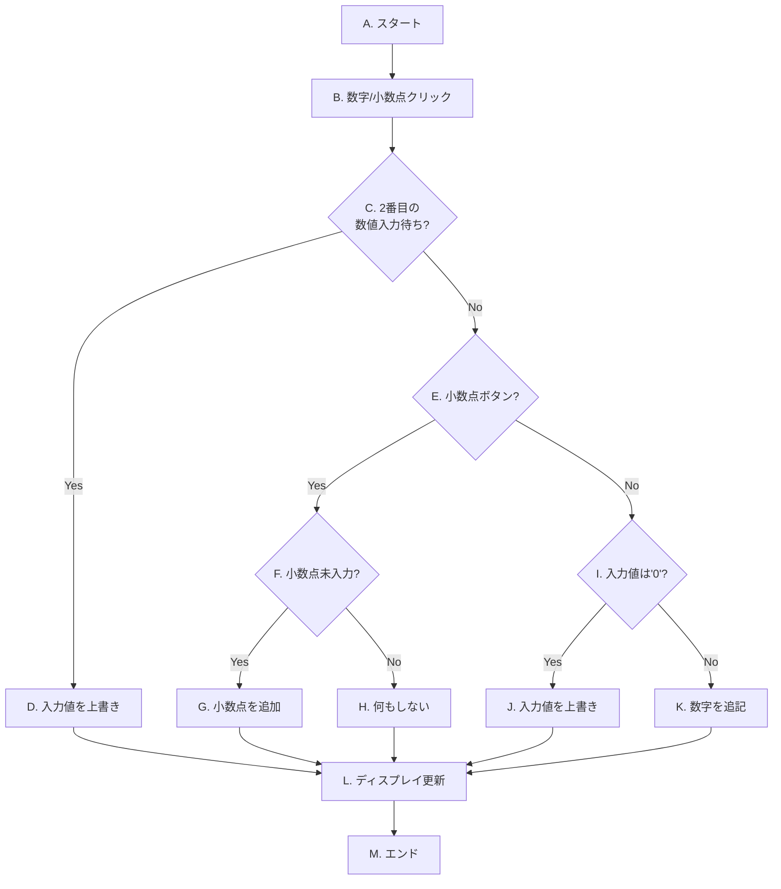
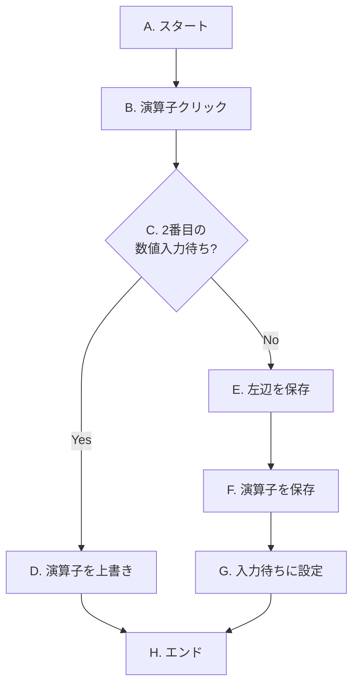
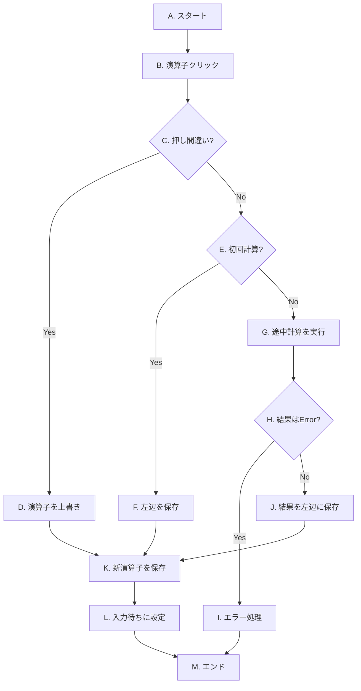

# OIC2026-calculator

電卓を作る
* 電卓のボタンを押すと表示窓に数値が表示される
* 四則演算を実行
* 「＝」ボタンで計算結果表示
* クリア・ACの動きを作る

# 電卓アプリケーション開発 課題仕様書・手順書

この資料は、専門学校の学生がJavaScriptを用いて電卓アプリケーションを作成するための仕様書および手順書です。

この教材のねらいは、いきなりコードを書くのではなく、**「設計の手順を踏んでから実装する」**という、プロのエンジニアの進め方を体験することです。各ステップは次の流れで構成されています。

### 📐 設計から実装までの5ステップ

| 手順 | やること | この教材での見出し |
|------|----------|--------------------|
| ① 要件の整理 | 「何ができればよいか」をはっきりさせる | **課題** |
| ② データ・状態の設計 | 「どんな情報を覚えておく必要があるか」を考える | **データ・状態の設計** |
| ③ 処理の設計 | 「どんな順番・条件で処理するか」を図にする | **処理の設計（フローチャート）** |
| ④ 実装 | 設計をコードに翻訳する | **実装のヒント** → 解法 |
| ⑤ 動作確認 | 思った通り動くかテストする | **動作確認チェックリスト** |

まずは①〜③を自分の頭で考え、④で実装に挑戦し、⑤で確認する——この順番を意識して進めてください。

> 📘 **解法（コード例）について**
> 答え合わせ用の解法（コード例）は [docs/explanation.md](docs/explanation.md) にまとめています。まずは自力で設計・実装に挑戦し、最後に解説を見て答え合わせをしましょう。

> 🗂️ **この教材はステップごとに公開されます**
> これは **全ステップ（Step 1〜5）** が揃った完成版です。

---

## Step 1: 画面の表示 (HTML/CSS)
最初の目標は、電卓の見た目をHTMLとCSSで作成することです。

### 1.1. 課題（要件の整理）
以下の仕様を満たす電卓のレイアウトを作成しなさい。
* **全体**: 電卓のすべての部品を囲む、一つの大きな箱(div)を用意する。
* **ヘッダ（ドラッグ用の取っ手）**: 電卓の上部に、後で電卓を移動させるときに「つかむ場所」となる帯を用意する。
* **ディスプレイ**: 数字や計算結果が表示される画面部分を作成する。
* **ボタン**:0〜9の数字、小数点(.)、四則演算(+, -, *, /)、オールクリア(AC)、イコール(=)の各ボタンを配置する。CSSで見やすく、4列に並ぶようにレイアウトする。
* **準備**: 後のステップで実装する「ドラッグ移動機能」のために、電卓全体が画面上の好きな位置に配置できるよう、CSSで準備をしておく。

### 1.2. レイアウト設計の考え方
* **部品の分け方**: `
` タグで部品を意味のあるまとまり（ヘッダ・ディスプレイ・ボタン群）に分け、`class`属性で名前をつけます。
* **ボタンの並べ方**: `display: flex` と `flex-wrap: wrap` を使い、各ボタンの幅を「全体の25%」にすると4列に並びます。
* **移動の準備**: `position: fixed` にしておくと、後から `top` / `left` で好きな位置に動かせます。
* **ドラッグ用の取っ手**: ボタンと「つかむ場所」を分けておくと、後で「ボタンを押す操作」と「電卓を動かす操作」が混ざりません（理由は後のステップで扱います）。

### 1.3. 動作確認チェックリスト
- [ ] 上部にヘッダ（取っ手）、その下にディスプレイ、さらに下にボタンが並んでいる
- [ ] ボタンが4列に整列している
- [ ] AC・数字・四則演算・= のボタンがすべて表示されている

➡️ 解法は [docs/explanation.md - Step 1](docs/explanation.md#step-1-画面の表示-htmlcss) を参照してください。

---

## Step 2: イベントの設定 (JavaScript)
見た目ができたら、次はボタンが押されたことをJavaScriptで検知できるようにします。

### 2.1. 課題（要件の整理）
各ボタン（数字、四則演算、AC、=）がクリックされたことをJavaScriptで検知し、押されたボタンの内容をコンソールに出力できるようにしなさい。

### 2.2. データ・状態の設計
この段階ではまだ計算しないので、覚えておく情報（状態）はありません。代わりに「**あとで何度も使うHTML要素**」をまとめて取得しておきます。
* ディスプレイ、数字ボタン群、演算子ボタン群、AC、= の5種類を、それぞれ変数に入れておくと後がラクになります。

### 2.3. 処理の設計
* どのボタンも「クリックされたら → その内容をコンソールに出す」という同じ形です。
* `addEventListener('click', ...)` でクリックを検知します。

### 2.4. 動作確認チェックリスト
- [ ] 数字ボタンを押すと、その数字がコンソールに出る
- [ ] 四則演算・AC・= を押すと、それぞれの内容がコンソールに出る

➡️ 解法は [docs/explanation.md - Step 2](docs/explanation.md#step-2-イベントの設定-javascript) を参照してください。

---

## Step 3: 計算機能の実装（基本編）
いよいよ電卓の心臓部である計算ロジックを実装します。まずは `1 + 2 = 3` のような簡単な計算ができることを目指します。

### 3.1. 準備
#### 3.1.1. 状態管理用の変数を準備しよう
##### 課題（要件の整理）
計算には「今入力している数値」や「前に押された演算子」など、様々な情報が必要です。これらの情報を一時的に保存しておくための「変数」を`app.js`の冒頭に準備してください。

##### データ・状態の設計
電卓が計算するために「覚えておくべき情報」を洗い出してみましょう。最低限、次の4つが必要です。それぞれ**どんな型（文字列・数値・真偽値）が適切か**も考えてみてください。

| 覚えておく情報 | 役割 | 型のヒント |
|----------------|------|------------|
| 今入力している数値 | 画面に出ている数値 | 文字列（画面表示と同じ形） |
| 前に押された演算子 | `+` `-` `*` `/` のどれか | 文字列 |
| 左辺の数値 | 計算の左側の数 | 数値（まだ無ければ「無し」を表す値） |
| 2番目の数値入力待ちか | 演算子を押した直後かどうか | 真偽値（はい/いいえ） |

➡️ 解法は [docs/explanation.md - Step 3.1.1](docs/explanation.md#311-状態管理用の変数を準備しよう) を参照してください。

#### 3.1.2. 便利な関数を準備しよう
##### 課題（要件の整理）
①ディスプレイの表示を更新する、②計算状態をすべてリセットする、という2つの便利な関数 `updateDisplay()` と `clearAll()` を作成してください。

##### 処理の設計
* `updateDisplay(value)` … 受け取った値をディスプレイ要素の `textContent` に設定するだけ。
* `clearAll()` … 3.1.1で準備したすべての状態変数を初期値に戻し、ディスプレイも `"0"` に戻す。ACボタンのクリックでこれを呼ぶ。

> 💡 **設計のヒント**: よく使う処理を「名前のついた関数」にまとめておくと、後で何度でも呼び出せて、コードの意味も読み取りやすくなります。これが「関数に分ける」という設計の第一歩です。

➡️ 解法は [docs/explanation.md - Step 3.1.2](docs/explanation.md#312-便利な関数を準備しよう) を参照してください。

### 3.2. 入力処理
#### 3.2.1. 数字・小数点ボタンの処理
##### 課題（要件の整理）
数字ボタン（0-9）と小数点ボタン(.)が押されたときに、ディスプレイの表示が正しく更新されるように、`inputDigit()` 関数を実装してください。

##### 処理の設計（フローチャート）

* **[C] 2番目の数値入力待ち?**: `isWaitingForSecondOperand` が `true` かどうかを判定します。
* **[D] 入力値を上書き**: **[C]** がYesの場合、`currentInput` を新しい数値で上書きし、`isWaitingForSecondOperand` を `false` に戻します。
* **[F] 小数点未入力?**: **[E]** がYesの場合、`currentInput` に `.` が含まれていないかを確認します。
* **[I] 入力値は'0'?**: **[E]** がNoの場合、`currentInput` が `"0"` の時に、`0` 以外の数字が押されたかを判定します。

##### 動作確認チェックリスト
- [ ] `7` を押すと `7` が表示される
- [ ] `0` の状態で `5` を押すと `5` に上書きされる（`05` にならない）
- [ ] `1` `.` `5` で `1.5` になる
- [ ] 小数点を2回押しても `1..` のように増えない

➡️ 解法は [docs/explanation.md - Step 3.2.1](docs/explanation.md#321-数字小数点ボタンの処理) を参照してください。

### 3.3. 簡単な計算 (A + B = C) の実装
#### 3.3.1. 演算子ボタンの処理（状態保存と押し間違い対応）
##### 課題（要件の整理）
`123 +` のように初めて演算子が押されたときの処理と、`5 *` の直後に間違えて `+` を押すような「押し間違い」に対応する `inputOperator()` 関数を実装してください。

##### 処理の設計（フローチャート）

* **[C] 2番目の数値入力待ち?**: `isWaitingForSecondOperand` が `true` か（押し間違いか）を判定します。
* **[D] 演算子を上書き**: **[C]** がYesの場合、計算はせず `operator` を新しい演算子で上書きするだけにします。
* **[E, F, G]**: **[C]** がNoの場合、`currentInput` を `left` に保存し、押された演算子を `operator` に保存。`isWaitingForSecondOperand` を `true` にします。

##### 動作確認チェックリスト
- [ ] `5` `+` を押しても画面は `5` のまま（演算子では表示は変わらない）
- [ ] `5` `+` の後に数字を押すと、新しい数値に切り替わる
- [ ] `5` `*` の直後に `+` を押す（押し間違い）と、演算子だけが `+` に変わる

➡️ 解法は [docs/explanation.md - Step 3.3.1](docs/explanation.md#331-演算子ボタンの処理状態保存と押し間違い対応) を参照してください。

#### 3.3.2. 計算実行関数 `calculate` の作成
##### 課題（要件の整理）
2つの数値と演算子を受け取って、計算結果を返す `calculate()` 関数を作成してください。0で割った場合のエラー処理も実装します。

##### 処理の設計
* 演算子の種類によって処理を分けるには `switch` 文が便利です。
* `/`（割り算）で、割る数が `0` のときは計算せず `"Error"` という文字列を返します。
* この関数は**状態変数には触れず、受け取った値だけで答えを返す**ように設計します（「純粋な計算」だけを担当）。こうすると、この関数だけを取り出して動作確認できます。
* 浮動小数点の誤差（例: `0.1 + 0.2` が `0.30000000000000004` になる）を抑えるため、結果を適度な桁で丸めます。

##### 動作確認チェックリスト
- [ ] `calculate(2, '+', 3)` が `5` を返す
- [ ] `calculate(10, '/', 0)` が `"Error"` を返す
- [ ] `calculate(0.1, '+', 0.2)` が `0.3` を返す（誤差が出ない）

➡️ 解法は [docs/explanation.md - Step 3.3.2](docs/explanation.md#332-計算実行関数-calculate-の作成) を参照してください。

#### 3.3.3. `=` ボタンの処理
##### 課題（要件の整理）
`=`ボタンが押されたら、`calculate()`関数を使って計算を実行し、結果を表示する `handleEquals()` 関数を実装してください。

##### 処理の設計
* まず、計算に必要な情報（`left`・`operator`・2番目の数値）が揃っているかを確認します。揃っていなければ何もしません。
* 計算結果が `"Error"` の場合は、状態をリセットしてエラー表示にします。
* 計算後は、その結果を使って続けて計算できるように状態を更新しておきます。

##### 動作確認チェックリスト
- [ ] `1` `+` `2` `=` で `3` が表示される
- [ ] `8` `-` `3` `=` で `5` が表示される
- [ ] `5` `/` `0` `=` で `Error` が表示される
- [ ] `=` をいきなり押しても何も起きない（エラーにならない）

➡️ 解法は [docs/explanation.md - Step 3.3.3](docs/explanation.md#333--ボタンの処理) を参照してください。

---

## Step 4: 計算機能の実装（発展編）
基本機能が完成したら、次は `1 + 2 + 3 =` のような連続計算に対応できるように機能を拡張します。

### 4.1. 連続計算 (A + B + C ...) への対応
##### 課題（要件の整理）
`1 + 2 +` と押された時点で `3` を計算・表示できるように、Step 3.3.1 で作成した `inputOperator()` 関数を改良してください。

##### データ・状態の設計（変更点）
新しい変数は増えません。**`left` がすでに値を持っているか（＝初回の計算か、2回目以降の連続計算か）**を見分けることがポイントです。
* `left` が「無し」なら → 初回。今の数値を左辺に保存するだけ。
* `left` がすでに数値なら → 連続計算。ここまでの計算を実行して、結果を新しい左辺にする。

##### 処理の設計（フローチャート）

* **[C] 押し間違い?**: `isWaitingForSecondOperand` が `true` かを判定します。
* **[E] 初回計算?**: `left` が `null` かどうかで、最初の計算か連続計算かを判断します。
* **[G] 途中計算を実行**: **[E]** がNoの場合（連続計算）、ここまでの計算を実行します。
* **[J] 結果を左辺に保存**: 計算結果をディスプレイに表示し、次の計算のために `left` を更新します。

> 💡 **設計のごほうび**: Step 3 で「計算（`calculate`）」と「状態の管理（`inputOperator`）」を別の関数に分けておいたので、ここでの拡張は `inputOperator` の中身を直すだけで済みます。役割を分けて設計しておくと、後からの変更がラクになるという好例です。

##### 動作確認チェックリスト
- [ ] `1` `+` `2` `+` `3` `=` で `6` が表示される
- [ ] `1` `+` `2` `+` と押した時点で（`=` の前に）`3` が表示される
- [ ] 連続計算の途中で `0` で割ると `Error` になる

➡️ 解法は [docs/explanation.md - Step 4.1](docs/explanation.md#41-連続計算-a--b--c--への対応) を参照してください。

---

## Step 5: 画面移動機能の実装
最後に、電卓をドラッグ＆ドロップで移動できる機能を追加します。

### 5.1. 課題（要件の整理）
Step 1 で用意したヘッダ（取っ手）をマウスでドラッグして、電卓全体（`.calc_app`）を画面上の好きな位置に移動できるようにしてください。

### 5.2. データ・状態の設計
ドラッグには次の情報を覚えておく必要があります。
* **ドラッグ中かどうか**（真偽値）… マウスを動かしたとき「今はドラッグ中か？」を判断するため。
* **つかんだ瞬間のマウス位置**・**つかんだ瞬間の電卓の位置** … 「どれだけ動かしたか」を計算するため。

### 5.3. 処理の設計
マウス操作を3つのイベントに分けて考えます。

| イベント | どこで受け取るか | 役割 |
|----------|------------------|------|
| `mousedown` | **ヘッダ（取っ手）だけ** | ドラッグ開始。つかんだ位置を記録する |
| `mousemove` | **画面全体（document）** | ドラッグ中なら、移動量に合わせて電卓を動かす |
| `mouseup` | **画面全体（document）** | ドラッグ終了 |

> 💡 **設計のポイント（なぜこう分けるか）**
> * `mousedown` を**ヘッダだけ**にすると、数字ボタンを押したときに電卓が動いてしまう事故を防げます。「つかむ場所」と「押す場所」を分けるのが大事です。
> * `mousemove` と `mouseup` を**画面全体（document）**で受け取ると、マウスが電卓の外に出ても追従が止まりません。電卓の上だけで受け取ると、素早く動かしたときに途中で止まってしまいます。

### 5.4. 動作確認チェックリスト
- [ ] ヘッダをドラッグすると電卓が移動する
- [ ] 数字ボタンを押しても電卓は動かない（押すだけ）
- [ ] 素早くドラッグしても、マウスが電卓の外に出ても、移動が途切れない

➡️ 解法は [docs/explanation.md - Step 5](docs/explanation.md#step-5-画面移動機能の実装) を参照してください。
